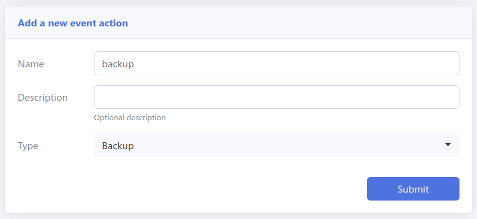
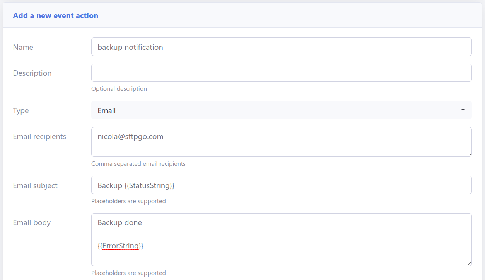
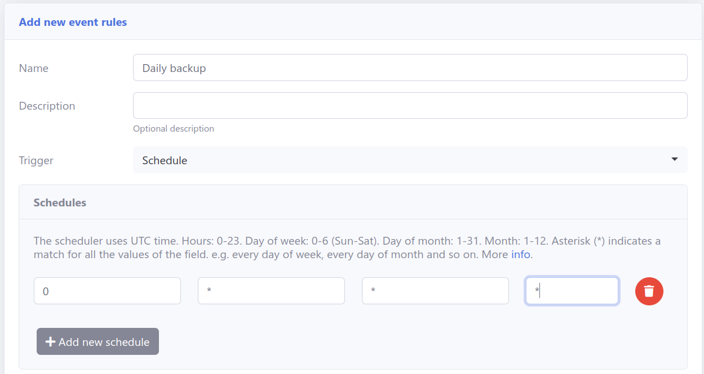
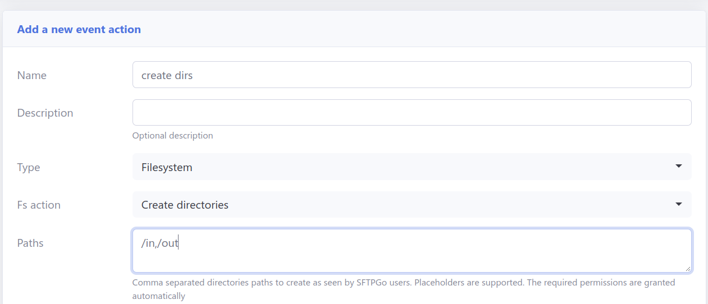
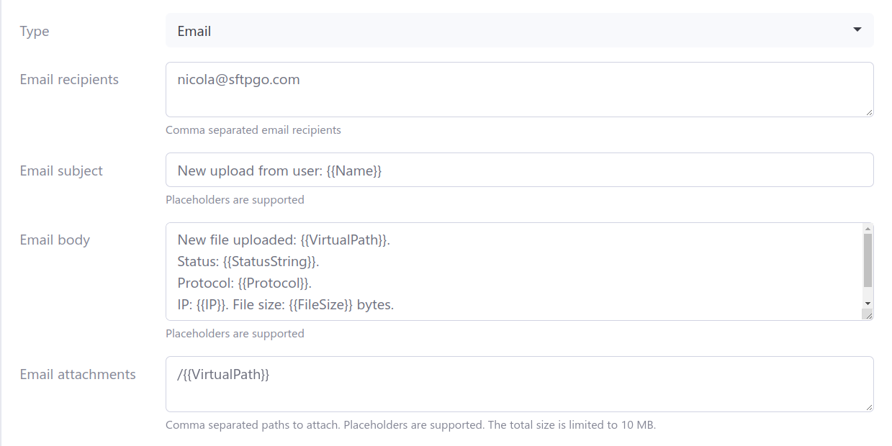

# Event Manager

The Event Manager allows an administrator to configure HTTP notifications, commands execution, email notifications and carry out certain server operations based on server events or schedules. More details [here](../eventmanager.md).

Let's see some common use cases.

- [Preliminary Note](#preliminary-note)
- [Daily backups](#daily-backups)
- [Automatically create a folder structure](#automatically-create-a-folder-structure)
- [Upload notifications](#upload-notifications)

## Preliminary Note

We will use email actions in the following paragraphs, so let's assume you have a working SMTP configuration.
You can adapt the following snippet to configure an SMTP server using environment variables.

```shell
SFTPGO_SMTP__HOST="your smtp server host"
SFTPGO_SMTP__FROM="SFTPGo <sftpgo@example.com>"
SFTPGO_SMTP__USER=sftpgo@example.com
SFTPGO_SMTP__PASSWORD="your password"
SFTPGO_SMTP__AUTH_TYPE=1 # change based on what your server supports
SFTPGO_SMTP__ENCRYPTION=2 # change based on what your server supports
```

SFTPGo supports several placeholders for event actions. You can see all supported placeholders by clicking on the "info" icon at the top right of the add/update action page.

## Daily backups

You can schedule SFTPGo data backups (users, folders, groups, admins etc.) on a regular basis, such as daily.

From the WebAdmin expand the `Event Manager` section, select `Event actions` and add a new action.
Create an action named `backup` and set the type to `Backup`.



Create another action named `backup notification`, set the type to `Email` and fill the recipient/s.
As email subject set `Backup {{StatusString}}`. The `{{StatusString}}` placeholder will be expanded to `OK` or `KO`.
As email body set `Backup done {{ErrorString}}`. The error string will be empty if no errors occur.



Now select `Event rules` and create a rule named `Daily backup`, select `Schedule` as trigger and schedule a backup at midnight UTC time.



As actions select `backup` and `backup notification`.


Done! SFTPGo will make a new backup every day and you will receive an email with the status of the backup. The backup will be saved on the server side in the configured backup directory. The backup files will have names like this `backup_<week day>_<hour>.json`.

## Automatically create a folder structure

Suppose you want to automatically create the folders `in` and `out` when you create new users.

From the WebAdmin expand the `Event Manager` section, select `Event actions` and add a new action.
Create an action named `create dirs`, with the settings you can see in the following screen.



Create another action named `create dirs failure notification`, set the type to `Email` and fill the recipient/s.
As email subject set `Unable to create dirs for user {{ObjectName}}`.
As email body set `Error: {{ErrorString}}`.


Now select `Event rules` and create a rule named `Create dirs for users`, select `Provider event` as trigger, `add` as provider event and `user` as object filters.


As actions select `create dirs` and `create dirs failure notification`, check `Is failure action` for the notification action.
This way you will only be notified by email if an error occurs.


Done! Create a new user and check that the defined directories are automatically created.

## Upload notifications

Let's see how you can receive an email notification after each upload and, optionally, the uploaded file as well.

From the WebAdmin expand the `Event Manager` section, select `Event actions` and add a new action.
Create an action named `upload notification`, with the settings you can see in the following screen.



You can optionally add the uploaded file as an attachment but note that SFTPGo allows you to attach a maximum of 10MB. Then the action will fail for files bigger than 10MB.

Now select `Event rules` and create a rule named `Upload rule`, select `Filesystem evens` as trigger and `upload` as filesystem event.
You can also filters events based on protocol, user and group name, filepath shell-like patterns, file size. We omit these additional filters for simplicity.


As actions, select `upload notification`.
Done! Try uploading a new file and you will receive the configured email notification.
